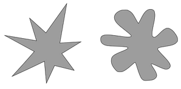

# Read your mind
* Two shapes
* Find their name
* One is `Bouba` and another one is `Kiki` 
* Who is `Bouba`? Who is `Kiki`? 

  
shapes

  

[Read more about Kiki Bouba](https://en.wikipedia.org/wiki/Bouba/kiki_effect)